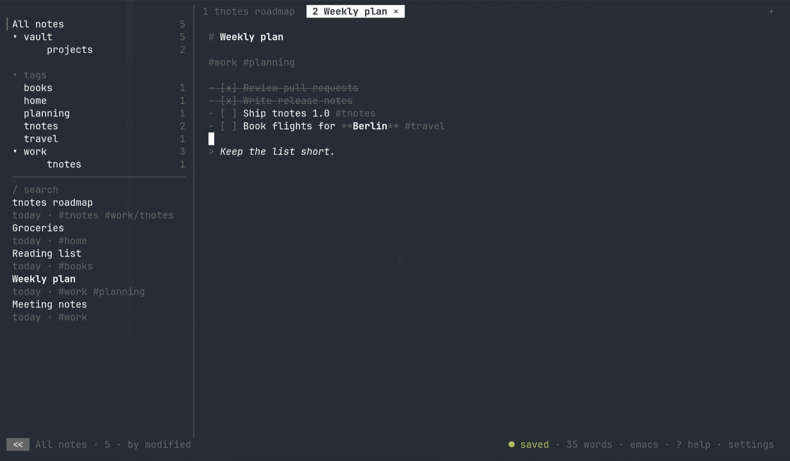

# tnotes

**t**erminal **notes**: minimal Markdown notes with folders, `#tags`, `[[links]]`, tabs, live highlighting, a mouse-first TUI — and a headless CLI so scripts and AI agents can work the same vault.




## Features

- Plain `.md` files on disk: atomic saves, conflict copies instead of silent overwrites, live reload when a file changes outside the app.
- Folders are real directories; `#tags` are parsed from the text, including nested ones like `#work/project`.
- `[[Note title]]` links: completion popup, `alt+enter` / `ctrl+click` to follow (a missing target is created), backlinks overlay, and links are rewritten when a note's title changes.
- Tabs with a single preview tab: selecting a note previews it, editing or pressing Enter pins it.
- Live Markdown highlighting while you type: headings, lists, checkboxes, code, links, emphasis, quotes, tags.
- List continuation on Enter, Tab / Shift+Tab to nest items, Alt+x or a click to toggle a checkbox.
- Emacs or vim editing keys (powered by edtui).
- Mouse-first: click to select, double-click to pin, right-click context menus, wheel scrolling, drag to select text; a narrow single-panel layout for small terminals.
- Session restore: open tabs, filter, sort, focus and folded sections come back on the next launch.
- In-app settings page (`F2` or `,`) that writes the config file for you.
- Five-colour theme that follows your terminal palette.
- Headless CLI (`tnotes ls | search | cat | new | trash`, `--json`) for scripts and agents; a running TUI picks the changes up live.

## Install

Requires Rust ≥ 1.98.

```sh
cargo install tnotes
```

or from git:

```sh
cargo install --git https://github.com/0x1ocean/tnotes
```

Prebuilt Linux x86_64 binaries are attached to each [release](https://github.com/0x1ocean/tnotes/releases).

## Usage

```sh
tnotes                # open your configured roots
tnotes ~/path         # add the folder to your roots (saved to config) and open it
tnotes --dir ~/path   # use only this folder for the session; config roots are left untouched
```

Headless subcommands work on the same files (`--dir` and `--json` apply to all of them):

```sh
tnotes ls [--tag work] [--folder notes/sub]      # id · title · tags, newest first
tnotes search "milk" [--tag …] [--folder …]      # fuzzy over titles and bodies, best first
tnotes cat weekly-plan                           # print the note
tnotes new "Weekly plan" --tag work [--folder …] # prints the new id
echo "body" | tnotes new "Piped" --stdin         # body below the title (or whole note without a title)
tnotes trash weekly-plan                         # move to the root's .Trash
tnotes ls --json                                 # id, path, title, folder, tags, links, backlinks, created, modified, preview
```

A note is addressed by its id (`root/sub/stem` as printed by `ls`), a path, or a unique file stem.

The first launch asks where your notes live (default `~/Documents/notes`).

### Use with AI agents

The CLI is the agent interface: no daemon, no API — just files and JSON. Point an agent at your vault and let it read, search and write notes while you keep the TUI open; edits show up live in both directions.

```sh
tnotes ls --json                                  # every note with tags, links, backlinks, timestamps and a preview
tnotes search "standup" --json | jq '.[0].path'   # best match first
tnotes cat vault/weekly-plan                      # full text
echo "- [ ] follow up with Ann" | tnotes new "Meeting notes" --tag work --stdin
```

Notes reference each other with `[[Title]]`; `links` and `backlinks` in the JSON let an agent walk the graph. A note's id (`root/sub/stem`) is stable across `ls`, `search`, `cat` and `trash`.

## Keys

The in-app `?` page is the source of truth.

| Scope | Action | Keys |
|---|---|---|
| global | new note | `ctrl+t` |
| global | preview / edit | `ctrl+l` |
| global | close tab | `ctrl+w` |
| global | next tab | `alt+.` · `ctrl+x` · `ctrl+pgdn` · `alt+→` |
| global | previous tab | `alt+,` · `ctrl+pgup` · `alt+←` |
| global | jump to tab | `1-9` |
| global | sidebar / panel | `ctrl+b` |
| global | next pane | `tab` |
| global | previous pane | `shift+tab` |
| global | settings | `F2` |
| global | help | `F1` |
| global | quit | `ctrl+q` · `ctrl+c` |
| list | move | `j/k` `↑/↓` |
| list | edit (pins the tab) | `enter` / `l` |
| list | search | `/` |
| list | trash (in trash: delete) | `d` |
| list | undo trash | `u` |
| list | restore (trash) | `r` |
| list | move to folder | `m` |
| list | sort | `s` |
| list | top / bottom | `gg` / `G` |
| list | help / settings | `?` `,` |
| tree | filter | `enter` |
| tree | fold | `space` |
| tree | new / rename / delete folder | `N` / `R` / `D` |
| tree | switch pane | `h` / `l` |
| editor | back to list | `esc` |
| editor | complete tag | `#…` `tab` |
| editor | complete link | `[[…` `tab` |
| editor | follow [[link]] · backlinks | `alt+enter` |
| editor | continue list · empty item ends it | `enter` |
| editor | toggle task (or click the box) | `alt+x` |
| editor | nest / un-nest list item | `tab` / `shift+tab` |
| editor | #tag → filter · [[link]] → open | `ctrl+click` |
| editor · emacs | find in note | `ctrl+s` |
| editor · emacs | undo / redo | `ctrl+u` / `ctrl+r` |
| editor · emacs | word back / forward | `alt+b` / `alt+f` |
| editor · vim | insert | `i` `a` `I` `A` `o` `O` |
| editor · vim | normal · then back to list | `esc` |
| editor · vim | undo / redo / repeat | `u` · `ctrl+r` · `.` |
| editor · vim | search | `/` `n` `N` |
| mouse | click / double-click | select · pin |
| mouse | right-click | context menu |
| mouse | wheel / drag | scroll · select text (copied on release) |
| mouse | shift+drag | the terminal's own selection, bypassing tnotes |

## Configuration

`~/.config/tnotes/config.toml` — every key with its default:

```toml
roots = ["~/Documents/notes"]

[appearance]
compact = false          # one-line list items instead of title + preview
dates = "relative"       # relative | absolute
counts = true            # note counts on the right of tree rows
sidebar_width = 32       # 24..=48
tab_numbers = "always"   # always | multi (only when 2+ tabs)

[editor]
keys = "emacs"           # emacs | vim
autosave_ms = 500        # idle time before a dirty tab is written; 200..=3000
template = "# "          # initial text of a new note; cursor lands at the end of the first line
wrap = true
width = 72               # max text column width in cells; 0 = full editor width
align = "left"           # left | center
cursor = "drawn"         # drawn (painted by the editor) | bar | underline | block (terminal cursor)
blink = false

[theme]                  # colour names (cyan, darkgray, #rrggbb, ...); unset keys keep the defaults
accent = "cyan"
dim = "darkgray"
warn = "yellow"
err = "red"
ok = "green"
```

Session state (open tabs, filter, sort, focus) lives in `~/.local/state/tnotes/state.toml`.

## How files are stored

- One `.md` file per note; the filename is a slug of the first line (the title), and it is renamed when the title changes.
- Folders in the tree are directories on disk. Every root has its own `.Trash/` that mirrors the folder layout, so trashed notes can be restored to where they came from.
- Dot-prefixed files and directories are ignored.
- Nothing else is written next to your notes, so the folder is safe to sync with git, Syncthing or any file sync.

## Vendored edtui

`vendor/edtui` is [edtui](https://github.com/preiter93/edtui) 0.11.7 (MIT, Philipp Reiter) with a word-wrap patch (`src/view/line_wrapper.rs`, cursor mapping in `src/view/internal.rs`, scrolling in `src/state/view.rs`); upstream wraps by character only. It is published as [`edtui-tnotes`](https://crates.io/crates/edtui-tnotes) so `cargo install tnotes` works; the workspace builds it from `vendor/` via a `path` dependency.

## Releasing

1. Move the `[Unreleased]` items in `CHANGELOG.md` under a new `## [X.Y.Z] - YYYY-MM-DD` heading and bump `version` in `Cargo.toml` (and `vendor/edtui/Cargo.toml` if the fork changed).
2. `git tag vX.Y.Z && git push origin main vX.Y.Z`.

The `Release` workflow checks that the tag matches `Cargo.toml`, runs the test suite, attaches a Linux x86_64 binary to a GitHub release whose notes are that changelog section, and publishes `edtui-tnotes` (when its version is new) and `tnotes` to crates.io.

## License

MIT — see [LICENSE](LICENSE).
